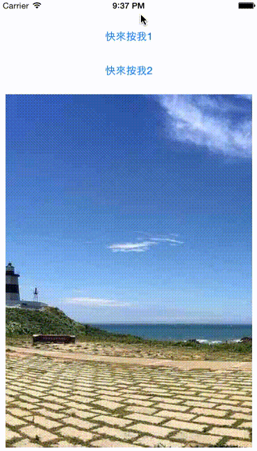

# Welcome to OA's HUD!

一個簡單的 iOS HUD App 練習！

---

## 聲明
本作品授權採用 姓名標示-非商業性 2.0 台灣 (CC BY-NC 2.0 TW) 授權，詳見 [http://creativecommons.org/licenses/by-nc/2.0/tw/](http://creativecommons.org/licenses/by-nc/2.0/tw/) 

 
## 簡介
* 練習使用 UIWindow、objc/runtime.h、UIVisualEffectView.. 等效果，製作一個簡單的 Head-Up Display。
* 作品參考了很多製作方式，其中參考了 [MBProgressHUD](https://github.com/jdg/MBProgressHUD)、[DTAlertView](https://github.com/Darktt/DTAlertView)、[DaiInboxHUD](https://github.com/DaidoujiChen/DaiInboxHUD)、[ProgressHUD](https://github.com/relatedcode/ProgressHUD)、[SVProgressHUD](https://github.com/TransitApp/SVProgressHUD).. 等各專案，的製作方式。
* 初步學習時，參考文章 [make HUD by your self | 沒有人的地盤](http://nobodyyu.github.io/2015/05/04/make-HUD-by-your-self/) 學習 window 使用..等概念。
* 在 [DaiInboxHUD](https://github.com/DaidoujiChen/DaiInboxHUD) 專案中，學習到 objc/runtime.h、objc_setAssociatedObject、objc_getAssociatedObject、animateWithDuration 的使用。

 
## 關於
* 作者名稱 - [OA Wu](http://www.ioa.tw/)

* E-mail - <comdan66@gmail.com>

* 作品名稱 - [OAHUD](https://github.com/comdan66/OAHUD)

* 更新日期 - 2015/07/09